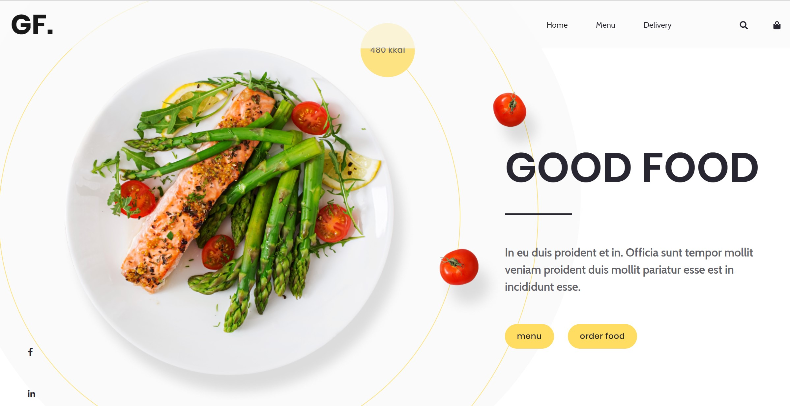
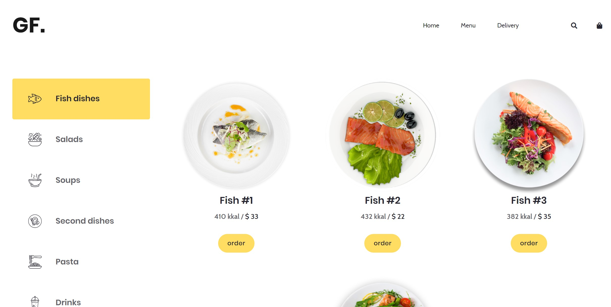
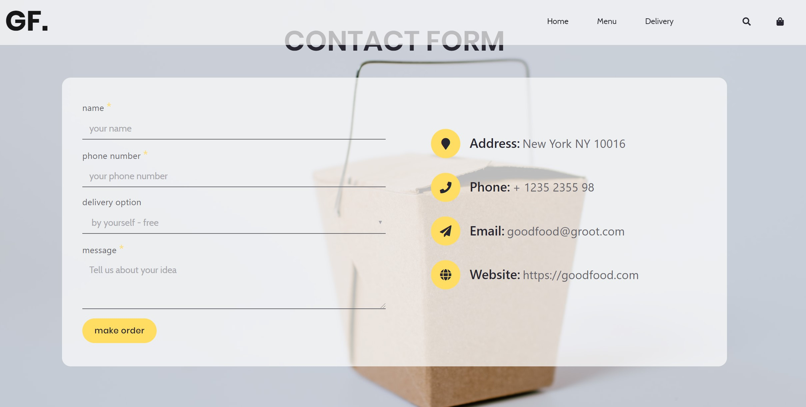

<h1>Website project for the restraunt Good Food</h1>

<h2>You're able to use link in order to load page
  

  <a href="https://sokolovskiyandrew.github.io/good_food/" targer="blank" >Good Food</a>
  

  
 <h3>If you want to navigate throught website - use header or footer menu in order to leap to 'menu' or 'delivery' pages</h3>

<h2>Menu page</h2>
  

<h2>Delivery page</h2>
  

